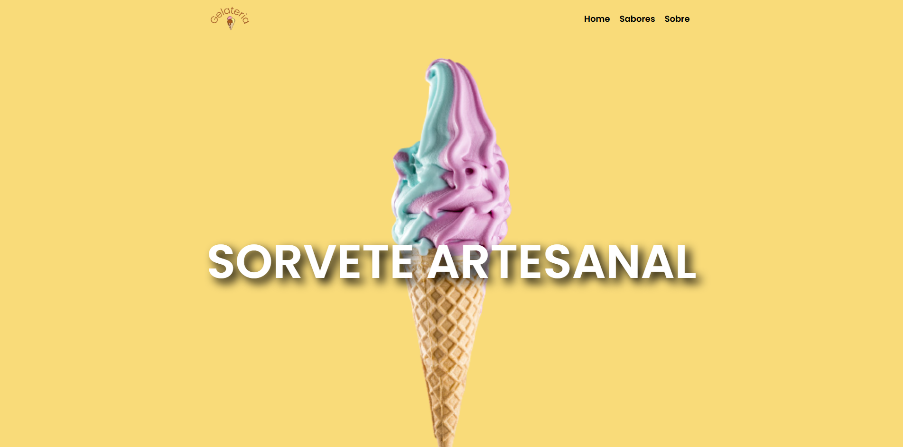
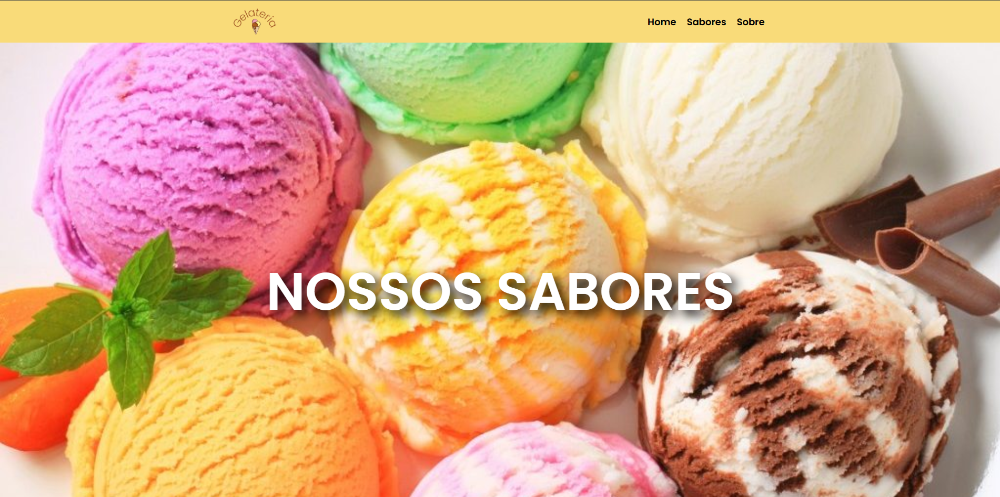
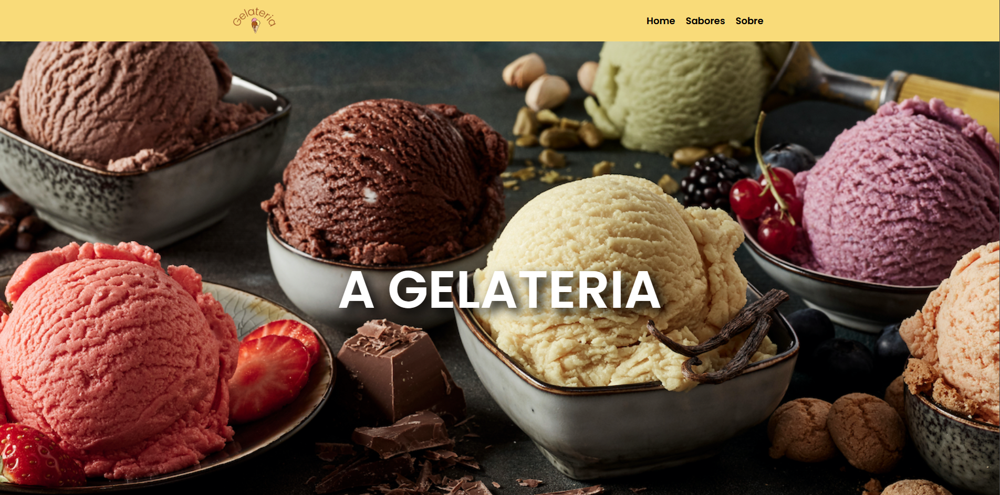

# Gelateria

## Objetivo

A proposta desse projeto foi criar um site fictício para uma gelateria utilizando React.js, HTML semântico e React Router Dom (react-router-dom) para navegação entre páginas. O site possui uma interface moderna e responsiva, destacando os produtos e a identidade da gelateria.

##### Funcionalidades Principais

- Home: Página inicial apresentando a gelateria, seu conceito e um banner chamativo.
- Sabóres: Página exibindo os sabores disponíveis e suas respectivas descrições.
- Sobre: Página com informações sobre a gelateria.

A estrutura foi construída com componentes reutilizáveis, garantindo acessibilidade e performance, seguindo boas práticas de desenvolvimento web.

### Conhecendo o projeto

O site está dividida em **3 páginas**. Cada página possui um tipo de informação diferente.

#### Home

<figure>
  
  <figcaption align="center">
    Figura 1.
    
  Home da página.</figcaption>
</figure>

#### Sabores

<figure>
  
  <figcaption align="center">
    Figura 2.
    
  Página inicial do site.</figcaption>
</figure>

#### Sobre

<figure>
  
  <figcaption align="center">
    Figura 3.
    
  Página com informações da página.</figcaption>
</figure>

### `npm start`

Para rodar o projeto no modo de desenvolvimento, execute o comando `npm start`.
Abra [http://localhost:3000](http://localhost:3000) para visualizá-lo em seu navegador.

### `deploy`

O deploy da aplicação foi realizado na plataforma [Vercel](https://vercel.com/).
E poderá ser acompanhado através do seguinte link: (<https://gelateria-rho.vercel.app/>).
